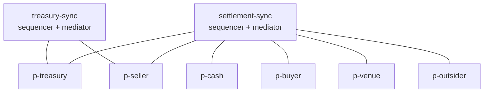
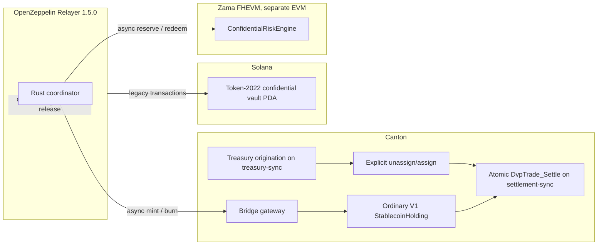

# canton-treasury-dvp

Atomic Delivery-versus-Payment settlement of a tokenized Treasury instrument against a regulated
payment stablecoin, across independently governed Canton applications.

The two assets are issued and administered by two separate registries that share no code and no
package dependency. A third, independently governed settlement application composes them into a
single atomic trade. No participant in the system sees more than the data it needs.

## Why this is a Canton-specific design

The problem this repository models is not "move two tokens". It is: *two independently governed
issuers, who do not trust each other and do not share a codebase, must exchange assets with no
settlement risk, while each party learns only its own side of the trade.*

That combination is what Canton provides and what a single shared global ledger does not:

- **Atomic composition across applications.** The Treasury registry and the stablecoin registry are
  separate Daml packages with no dependency on each other. The settlement package depends on
  neither. They compose at runtime through the Canton Token Standard interfaces, and both legs
  commit in one transaction.
- **Sub-transaction privacy.** Canton projects each transaction to the parties entitled to see each
  node. The Treasury registry helps settle the trade without learning the cash amount; the
  stablecoin registry settles without learning the bond quantity; neither learns the trade price.
- **Multi-party authorization.** The trade contract is jointly signed by venue, seller, and buyer,
  so no single party can move another party's assets.
- **Independent governance.** Each application is upgraded, vetted, and operated separately. A
  participant may vet a package and still see none of the contracts created under it.

## The atomic DvP invariant

> There must never be a committed final state in which the buyer paid without receiving the Treasury
> asset, or the seller delivered the Treasury asset without receiving payment.

There is no intermediate state in which one leg has settled and the other has not, and no window in
which a party is exposed to the other side's performance. Both legs execute as consequences of a
single choice, `DvpTrade_Settle`, in one Daml transaction. If either leg fails for any reason, the
entire transaction is rejected and no asset moves.

This invariant is asserted directly: the Daml Script suite drives each leg into failure and proves
that no partial settlement is observable.

## Components

| Component | Package | Responsibility |
|---|---|---|
| Treasury registry | `daml/treasury-registry` | Treasury instrument, holdings, eligibility, allocation |
| Stablecoin registry | `daml/stablecoin-registry` | Stablecoin instrument, holdings, eligibility, mint and burn |
| Settlement | `daml/dvp-settlement` | Trade proposal, jointly signed trade, atomic settlement |
| Unit tests | `daml/tests` | 194 Daml Script tests |
| Integration | `daml/integration`, `daml/integration-control` | Multi-participant scenario and stream control event |

**Compliance** is modelled as per-registry eligibility attestations. Each registry issues its own
attestations for its own instrument, holds no personal data on ledger, and enforces eligibility
**only when an allocation is created**. Settlement itself performs no compliance check, which keeps
the atomic step self-contained and free of external dependencies at the moment of commitment.

The two registries are deliberately symmetric but independent: neither imports the other, and the
same eligibility idea is implemented twice rather than shared through a common package.

## Canton Token Standard

The registries implement Canton Network Token Standard **V1** interfaces (CIP-0056), vendored as
DARs in `lib/` from the Splice `v0.6.14` release bundle:

| Interface package | Version |
|---|---|
| `splice-api-token-metadata-v1` | 1.0.0 |
| `splice-api-token-holding-v1` | 1.0.0 |
| `splice-api-token-allocation-v1` | 1.0.0 |
| `splice-api-token-allocation-instruction-v1` | 1.0.0 |
| `splice-api-token-allocation-request-v1` | 1.0.0 |

Holdings implement `Holding`. Each registry exposes an `AllocationFactory` and produces
`Allocation` contracts that lock the sender's holding. The settlement package implements
`AllocationRequest`, so each registry independently discovers the legs it is being asked to fund
without depending on the settlement package's templates.

## Topology

The application runs on **two local synchronizers**. Treasury assets originate on `treasury-sync`;
everything the trade needs to settle lives on `settlement-sync`.



Each party is hosted on exactly one participant, and every command is submitted through the
participant that hosts the acting party.

| Participant | Party | Synchronizers | Ledger API port |
|---|---|---|---|
| `p-treasury` | `treasuryRegistry` | both | 5011 |
| `p-cash` | `cashRegistry` | `settlement-sync` | 5021 |
| `p-seller` | `seller` | both | 5031 |
| `p-buyer` | `buyer` | `settlement-sync` | 5041 |
| `p-venue` | `venue` | `settlement-sync` | 5051 |
| `p-outsider` | `outsider` | `settlement-sync` | 5061 |

Only the Treasury registry and the seller are connected to `treasury-sync`, because only they are
stakeholders on a Treasury holding at issuance. The cash registry, buyer, venue, and outsider never
join that synchronizer and therefore cannot observe anything that happens on it.

Package vetting follows the same split. The Treasury package is vetted on **both** synchronizers,
because both the source and the target of a reassignment must be able to validate the contract. The
stablecoin and settlement packages are vetted on `settlement-sync` only.

`p-outsider` is connected to `settlement-sync` and has every settlement-side package vetted, but
hosts no party involved in the trade. It exists to prove that connectivity and package availability
are not data visibility.

### Where each contract lives

| Created on `treasury-sync` | Created on `settlement-sync` |
|---|---|
| `TreasuryInstrument` | `TreasuryRules`, Treasury eligibility attestations |
| Seller's initial `TreasuryHolding` | Stablecoin instrument, rules, eligibility, holdings |
| | `DvpProposal`, `DvpTrade`, both allocations, the settlement transaction |

Only the Treasury holding that the trade consumes is reassigned. The instrument and the eligibility
attestations are not settlement inputs, so they are never moved.

Because Daml Script cannot prescribe a synchronizer, the contracts that must originate on
`treasury-sync` are created through the Ledger API from the Canton console with an explicit
synchronizer ID, and the placement of every contract is asserted afterwards rather than assumed.

## Reassignment

A Canton contract is assigned to exactly one synchronizer at a time. A transaction cannot span two
synchronizers, so the seller's Treasury holding must be moved onto `settlement-sync` before it can
be allocated to the trade.

The move is an **explicit unassign/assign pair** submitted over the Ledger API with explicit source
and target synchronizer IDs:

1. Confirm the holding is active on `treasury-sync` and record its reassignment counter.
2. Submit the unassignment from `treasury-sync` to `settlement-sync`; record the reassignment ID.
3. Confirm the contract is pending assignment and no longer active on the source.
4. Submit the assignment using that reassignment ID.
5. Confirm the **same contract ID** becomes active on `settlement-sync`.
6. Confirm owner, amount, instrument, and the full payload are unchanged.
7. Confirm the reassignment counter incremented exactly once.

Only then is the Treasury allocation created.

**Reassignment is not atomic and it is value-neutral.** Unassignment and assignment are two separate
protocol steps with an observable interval between them, during which the contract is assigned to
neither synchronizer and cannot be used. Reassignment never changes a payload, never transfers
ownership, and never creates or destroys value; it only changes where a contract is hosted.

Cross-synchronizer movement is a topology-level capability, not an application feature. The
participants that need it advertise multi-synchronizer support in their synchronizer trust
certificates as a deliberate, separate step. Until they do, Canton refuses to move the contract at
all, which is what the wrong-synchronizer scenario below relies on.

The integration run grants that capability only for the phases that perform an explicit
reassignment and revokes it again immediately afterwards, so no application phase can ever be
rescued by the automatic synchronizer router: if the explicit unassign/assign were removed, the
Treasury allocation would fail.

## DvP workflow

1. `treasuryRegistry` creates the Treasury instrument on `treasury-sync` and issues 100 units to
   `seller` there.
2. `cashRegistry` creates the stablecoin instrument on `settlement-sync` and mints 100,000 to
   `buyer`.
3. Each registry issues eligibility attestations for its own instrument on `settlement-sync`.
4. `seller` creates a `DvpProposal`.
5. `seller` and `buyer` each accept; approval is progressive and recorded on the proposal.
6. `venue` initiates settlement, creating the jointly signed `DvpTrade`.
7. The seller's Treasury holding is explicitly unassigned from `treasury-sync` and assigned to
   `settlement-sync`. Until this completes, the Treasury leg cannot be allocated.
8. `seller` allocates the Treasury leg through the Treasury `AllocationFactory`, which checks
   eligibility and locks the holding.
9. `buyer` allocates the payment leg through the stablecoin `AllocationFactory`.
10. `venue` exercises `DvpTrade_Settle` once. Both legs execute in that single transaction.

## Authorization model

- `DvpProposal` is signed by the seller and by each party that has approved. A party can only
  approve for itself, cannot approve twice, and the venue cannot approve on anyone's behalf.
- `DvpTrade` is signed jointly by `venue`, `seller`, and `buyer`. No subset can create it. This
  joint signature is what supplies the authority to execute both allocations later.
- `DvpTrade_Settle` is controlled by the venue, but it can only act within authority the seller and
  buyer already granted by signing the trade.
- Settlement validates the supplied allocations by **exact match**: each leg must be backed by
  exactly one allocation whose full specification, including the settlement reference, equals what
  the trade expects. Allocations created for a different trade are rejected even when the parties,
  amounts, and deadlines are identical, because each trade's settlement reference is derived from
  its originating proposal contract ID.

## Privacy model

Canton projects each transaction node only to the parties entitled to see it. The result, verified
against live participant update streams rather than assumed:

| Participant | Sees | Does not see |
|---|---|---|
| `p-treasury` | Treasury instrument, holdings, its eligibility inputs, Treasury allocation, Treasury settlement leg | Any stablecoin contract, the payment amount, the `DvpTrade` payload or price |
| `p-cash` | Stablecoin instrument, holdings, its eligibility inputs, stablecoin allocation, payment settlement leg | Any Treasury contract, the Treasury quantity, the `DvpTrade` payload or price |
| `p-seller` | Proposal, trade, both allocations, settlement outcome, its original Treasury holding, its resulting stablecoins | The buyer's original stablecoin holding, the outsider's contracts |
| `p-buyer` | Proposal, trade, both allocations, settlement outcome, its original stablecoins, its resulting Treasury units | The seller's original Treasury holding, the outsider's contracts |
| `p-venue` | Proposal approvals, full trade terms, both allocations, both settlement outcomes | Any eligibility attestation, unrelated holdings |
| `p-outsider` | Only its own control contract | Every proposal, trade, allocation, holding, eligibility, and settlement event |

Each registry helps settle a trade whose price it never learns.

Reassignment is projected the same way. Only `p-treasury` and `p-seller`, the participants hosting
the holding's stakeholders, receive the unassigned and assigned events; the verification checks the
reassignment ID, the source and target synchronizer IDs, and the exact contract ID on each. The cash
registry, buyer, venue, and outsider receive **no reassignment event at all**, so the stablecoin
registry never learns that the Treasury holding has a reassignment history, and none of them ever
sees the pre-settlement Treasury holding payload.

Every privacy assertion is made against participant update streams bounded by recorded offset
checkpoints, using exact contract IDs, reassignment IDs, and synchronizer IDs. No assertion relies
on a contract merely being absent from the active contract set.

## The atomic boundary

The atomic unit is **one Daml transaction on one synchronizer**. `DvpTrade_Settle` validates both
legs and executes both `Allocation_ExecuteTransfer` choices as consequences of that single choice.
Canton commits or rejects the whole transaction.

**Reassignment is outside this boundary.**

> Reassignment is a separate, non-atomic, value-neutral preparation step. Atomicity begins only when
> both allocations are available on `settlement-sync` and `DvpTrade_Settle` executes both transfer
> legs in one Daml transaction.

An atomic trade cannot span two synchronizers in one transaction, and the two synchronizers never
jointly execute anything. The inputs must first be brought onto a common synchronizer, and only then
can they be settled atomically.

This is why the two steps must not be confused. Reassignment is non-atomic and moves no value;
settlement is atomic and moves all of it. By the time `DvpTrade_Settle` runs, every input is
already active on `settlement-sync`, and the single transaction either commits both legs or
nothing.

## Technology

| Component | Version |
|---|---|
| Daml SDK | 3.5.5 |
| Canton runtime | 3.5.12 (open source) |
| Daml-LF target | 2.2 |
| JDK | 21 |
| Canton Token Standard | V1 (CIP-0056) |

## Completed baseline and the two new phases

M1–M7 remain the completed Canton-only MVP. This repository is still a negotiated
Treasury Delivery-versus-Payment system. It is not an AMM and does not add pools,
LP tokens, swap curves, or AMM pricing.

| Phase | Status |
|---|---|
| M1–M7 Canton atomic DvP, two synchronizers, verified privacy | **Complete** |
| Phase 1 confidential settlement rail | **Complete (local only).** Encrypted capacity, confidential Solana custody, 2-of-3 mint/release approvals, live Treasury DvP funded by the minted holding, seller redemption, Relayer release, Zama redeem, journal resume from on-chain state after partial success, rejected or finalized-unapproved reservations without lock or mint, post-redemption crash recording, exact Canton decimal strings, Canton completion checked from a connected update-history sequence rather than journal fields, and Zama capacity recovery checked with approval-only probes. |
| Phase 2 operational hardening of the confidential rail | **Complete (local only).** Each bridge lock is bound on ledger to its minted holding CID and `DvpTrade` CID. Prepare, settle, redeem, resume, and history verification use that binding, not a party-and-amount lookup. Release and mint expiry are taken from the Solana chain clock. Crash resume uses ledger contracts at each Canton and Solana/Zama boundary. Temporary secret files are created at `0600` under a `0700` directory. |
| Public hybrid verification | **Complete on 2 September 2026.** One connected operation used Solana Devnet, Zama Ethereum Sepolia with real FHE, and the private Canton topology. See [Public hybrid verification](#public-hybrid-verification). |

Phase 1 workflow, all asynchronous except the existing Canton settle:

1. Zama checks and reserves encrypted bridge capacity.
2. Solana tokens move confidentially into PDA custody.
3. Two of three attesters authorize the matching Canton mint.
4. The gateway mints an ordinary V1 `StablecoinHolding`.
5. That exact holding funds the buyer's payment allocation.
6. The coordinator creates and approves the Treasury trade, reassigns the Treasury holding, and exercises `DvpTrade_Settle`.
7. The seller burns the resulting stablecoins through the gateway.
8. Solana releases the backing tokens confidentially to the destination authorized for that redemption.
9. Zama reduces active exposure.

Only `DvpTrade_Settle` on `settlement-sync` is atomic. Zama is a separate EVM
environment. It is not inside Solana or Canton.



Cross-chain arrows are asynchronous. There is no single transaction that spans
Canton, Solana, and Zama.

### Roles

- **Canton** keeps Token Standard V1, independent registries, and atomic DvP.
- **Solana** holds Token-2022 confidential custody. Two distinct configured
  attesters must sign. Approvals are recorded in separate legacy transactions.
- **OpenZeppelin Relayer 1.5.0** is the accepted Solana submission path.
  Measured legacy sizes on the local validator, including the Relayer fee payer
  and the approval account, stayed under 1232 bytes: lock 1010, approve 725,
  release 844.
- **Zama** keeps capacity, exposure, and limits encrypted. Local Hardhat tests
  are **mock FHE execution**, not production cryptographic confidentiality.

The Daml gateway does not recompute the Solana canonical digest. Two attester
contracts must agree on lock, amount, beneficiary, and digest. The gateway does
not remove the stablecoin issuer's existing mint authority.

Amount commitments are `SHA-256(domain || amount || blinding)`. The blinding
value is not placed in public transactions or logs. Cross-scheme equality is
2-of-3 attested equality, not a cryptographic proof between Token-2022 and Zama
ciphertexts.

### Exact dependency pins

| Component | Pin |
|---|---|
| Daml SDK / Canton / Token Standard | 3.5.5 / 3.5.12 / V1 from Splice v0.6.14 |
| Node | 22 |
| Anchor | 0.31.1 |
| Solana CLI / Agave | 3.1.10 |
| Token-2022 (local zk-ops) | official `program@v7.0.0` (`ed6f74f960a3c06cf681c6b0a31552f2f4956df3`) |
| OpenZeppelin Relayer | 1.5.0 (`v1.5.0`, commit `3db7d38c34ca05ab5f51dd74817889a1e388eec6`) |
| OpenZeppelin Confidential Contracts | 0.5.1 |
| OpenZeppelin Contracts | 5.6.1 |
| `@fhevm/solidity` | 0.11.1 |
| `@fhevm/hardhat-plugin` / mock-utils | 0.4.2 |
| `@zama-fhe/relayer-sdk` | 0.4.1 |

### Bridge setup and tests

`make verify` checks the original Canton DvP only: 194 Daml tests, lint, DAR validation, the
two-synchronizer suite, and whitespace.

`make bridge-verify` checks the complete confidential bridge: `make verify`, then Solana, Zama
mock-FHE, bridge Daml, Rust, type-checking, the live E2E script, walkthrough gates included in
that script, license, secret, and dependency checks.

Bridge prerequisites, in addition to the original demo: Node 22, Rust, Solana
CLI 3.1.10, Anchor 0.31.1, Docker, and `cd zama && npm ci`. Agave 3.1.10 ships
Token-2022 without `zk-ops`; `scripts/build-token-2022-zk-ops.sh` builds the
official `program@v7.0.0` source and the local validator loads that program.

```bash
make verify
make bridge-test
scripts/bridge-e2e.sh
scripts/bridge-walkthrough.sh
make bridge-verify
```

Redemption trust boundary: `Gateway_Redeem` fetches `BridgeTradeBinding` and requires the same
cash registry, the same lock, `binding.seller == request.holder`, and
`binding.sellerPaymentCid` equal to the holding being burned. An incomplete binding or a binding
from another operation is rejected. The connected Canton history verifier then proves that the
recorded payment was created by the bound `DvpTrade_Settle`. That is a completion check, not
cross-chain atomicity.

`scripts/bridge-e2e.sh` starts only the local validator, Relayer 1.5.0, Hardhat,
and related processes it created. Occupied ports fail the run. Missing services
fail the run. `BRIDGE_E2E_COMPLETE` is printed only after expiry recovery on a locked
operation, an over-capacity reservation that stays rejected on retry and after a
later finalize with no Solana lock or Canton mint, coordinator restart after
on-chain success that was not saved locally (including between the two mint
attestations, after Canton settlement, after release-approval expiry on the
Solana chain clock, and after Zama redemption), the minted holding funds atomic
Treasury DvP, the seller's stablecoin is redeemed, a fresh 2-of-3 release
approval is collected after chain-clock expiry, confidential release through
Relayer confirms to the redemption destination, destination apply-pending is
not applied twice, a completed resume skips setup and funding and checks Canton
from a connected update-history sequence, a second resume of the completed
operation changes no ledger state, an unrelated lock is rejected, and Zama
capacity probes are rejected while exposure is live and approved after
redemption without decrypting amounts or limits.

Crash resume is tested at these boundaries: Treasury allocation without
payment allocation, both allocations without settlement, settlement without a
local journal save, redemption request without burn, burn without release
approval, Solana release without Zama redeem, and Zama redeem without a
completion journal save. Resume finds the existing lock, settlement reference,
and connected contracts. It creates only the missing allocation, reuses a valid
unexpired approval, and does not mint, burn, settle, release, or redeem twice.

`scripts/bridge-walkthrough.sh` is a separate operator run, not a second call
to `scripts/bridge-e2e.sh`. It checks two simultaneous Canton operations with
identical terms, attester disagreement, expiry before settlement, an expired
release approval after committed settlement, a stop after Canton redemption
and before Solana release, and two completed resumes that add no Solana or
Zama transactions. Contract IDs, signatures, and balances from that run stay
in the operator notes; they are not stored in this repository.

Local recovery measurements from `scripts/bridge-e2e.sh` on this machine.
These are not production benchmarks.

| Fault | Locked value (base units) | Locked state | Recovery | Chain duration | Terminal state | mint / settle / burn / release / zama |
|---|---|---|---|---|---|---|
| Attester disagreement | 100000000000 | Solana vault | Bad attestation ignored; later 2-of-3 minted once | 13–14 s from inject to quorum on this machine. Waiting for the second attestation is operator-controlled and can be unbounded. | `locked_awaiting_quorum`, then the same operation continued | 0 / 0 / 0 / 0 / 0 until quorum |
| Expiry before mint or settlement | 100000000000 | Solana vault | Mint approval rejected; cancel/refund path | 7 s | `cancelled` | 0 / 0 / 0 / 0 / 1 |
| Canton redeemed, Solana not released | 100000000000 | Solana vault | Connected history, one Relayer release | 78–81 s from inject to release on this machine. Waiting for operator resume is unbounded. | `canton_redeemed_solana_locked`, then `released` | 1 / 1 / 1 / 0 / 0 until resume |
| Release approval expired after settlement | 100000000000 | Solana vault | Fresh 2-of-3 from chain time; one release | 29–31 s | `released` | 1 / 1 / 1 / 1 / 0 |

Amounts use one convention: Solana and Zama carry integer base units; Canton
carries whole-token Decimals. With six decimals, 1 token is 1,000,000 base
units, so the demo is 100,000.000000 Canton units and 100,000,000,000
Solana/Zama base units. Canton script input keeps the amount as an exact
decimal string; it is not passed through floating point. The Daml gateway does
not recompute the Solana digest.

### Trust and privacy limitations

- Local-only and unaudited.
- Relayer, attesters, and the coordinator are trusted to submit the bound
  digest and to wait for confirmation.
- Token-2022 and Zama ciphertexts are not proven equal; attesters bind them.
- Local Zama tests use the FHEVM mock. Do not treat those results as production
  confidentiality.
- Recovery uses a local operation journal. Resume reads chain state and
  continues the unfinished step. It must not repeat mint, burn, release, or
  reservation. Cancellation and redemption approvals have their own deadlines,
  separate from the original mint deadline. A later 2-of-3 can recover an
  eligible locked operation after that mint deadline. Epoch on the Zama engine
  is a policy version and does not erase reserved or active exposure.
- Daml Script cannot prescribe a synchronizer or submit `actAs` across
  participants. Extra Treasury holdings for two live identical-term operations
  are issued on `treasury-sync` and explicitly reassigned. Settlement outputs
  are recorded on the binding by the buyer and the seller in separate choices.
  `Gateway_Mint` creates the only valid `BridgeMintRef`. The buyer selects the
  trade by consuming that reference. A buyer-only create is rejected.

## Repository structure

```
Makefile                       build, test, lint, validate, integration, verify, bridge-*, clean, distclean
docs/
  architecture.md              packages, placement, reassignment and allocation sequences
  privacy.md                   visibility matrix and what the privacy tests do and do not prove
  testing.md                   every test level and the command that runs it
canton/
  settlement-topology.conf     node definitions for both synchronizers and six participants
  remote-console.conf          remote console handles used by the console phases
  run-integration.sh           one-command integration run
  scripts/
    bootstrap.canton           both synchronizers, connections, parties, per-synchronizer vetting
    origination.canton         Treasury contracts on treasury-sync, wrong-synchronizer scenario
    reassignment-capability.canton
                               grants and revokes multi-synchronizer support in the trust certificates
    reassign.canton            explicit unassign and assign with counter and payload evidence
    probe-pending.canton       pending-assignment scenario and reassignment round trip
    verify-privacy.canton      per-participant update-stream privacy assertions
    bridge-bootstrap.canton    extra attesters and bridge-gateway vetting
    prepare-isolation-holdings.canton
                               two extra Treasury holdings on treasury-sync, then explicit reassignment
solana/                        Token-2022 confidential escrow program
zama/                          ConfidentialRiskEngine (FHEVM, mock in local tests)
bridge/                        Rust coordinator and Relayer 1.5.0 local config
daml/bridge-gateway/           Canton mint/redemption gateway
daml/bridge-tests/             gateway and bridged DvP scripts
daml/
  treasury-registry/           Treasury instrument, holdings, eligibility, allocation
  stablecoin-registry/         stablecoin instrument, holdings, eligibility, allocation
  dvp-settlement/              proposal, jointly signed trade, atomic settlement
  tests/                       194 Daml Script tests
  integration/                 multi-participant scenario, split into pre- and post-reassignment
  integration-control/         test-only control template for stream verification
lib/                           vendored Canton Token Standard V1 DARs
  CHECKSUMS.sha256             pinned digests of the vendored DARs
```

## Prerequisites

Original Canton demo:

- Daml SDK 3.5.5 via `dpm`, with `dpm` on `PATH`
- JDK 21
- The Canton runtime, which `dpm` installs under `~/.dpm/cache/components/canton-open-source`
- `make` and a POSIX shell, for the one-command entry points

No database is required for the original demo. All Canton nodes use in-memory storage.

Bridge Phases 1 and 2, in addition:

- Node 22
- Rust, Solana CLI, Anchor 0.31.1
- Docker, for stock OpenZeppelin Relayer 1.5.0 and Redis
- `cd zama && npm ci` before `make bridge-test`

## Quick start

`make verify` checks the original Canton DvP only. `make bridge-verify` checks the complete
confidential bridge.

```bash
make verify
make bridge-verify
```

`make verify` builds every core package, runs the 194 Daml Script tests, lints every module,
validates every DAR and checks the vendored Token Standard DARs against their pinned digests, runs
the two-synchronizer integration suite, and checks whitespace. It takes roughly three minutes from
a clean checkout, needs no database or container runtime, and leaves no process running.

Individual targets:

| Command | What it does |
|---|---|
| `make help` | list the targets (default) |
| `make build` | `dpm build --all` across `multi-package.yaml` |
| `make test` | the 194 Daml Script tests, failing if the count changes |
| `make lint` | `damlc lint` over every module in every package |
| `make validate` | validate every project DAR, and validate and digest-check the vendored DARs |
| `make integration` | the two-synchronizer Canton suite |
| `make clean` | remove generated Daml output, Rust and Solana targets, Zama artifacts and cache, TypeChain output, FHE temporary output, Canton and bridge run directories, and logs |
| `make distclean` | `make clean`, plus `zama/node_modules` and the downloaded `.cache` Token-2022 source |

`make clean` deletes only generated artifacts. Source, configuration, documentation, vendored DARs
under `lib/`, lockfiles, `zama/node_modules`, and the downloaded pinned Token-2022 source under
`.cache` are not removed. Solana keypairs stay untracked. `make verify` regenerates the original
Canton artifacts it needs.

The local escrow program ID is public and lives in `declare_id`, `Anchor.toml`, and
`bridge/src/program.rs`. Local tests load `confidential_escrow.so` with
`--bpf-program` at that address. They do not deploy with a private key. Devnet must use a newly
generated ignored keypair and must not reuse the local test identity. After a real Devnet deploy,
commit only the public program ID.

## Daml Script tests

The unit suite runs on the in-memory ledger and needs no Canton node:

```bash
make test
```

Expected: **194 tests pass**. These cover holdings, mint and burn, eligibility, allocation
lifecycle, exact-leg validation, settlement-reference isolation, and the no-partial-settlement
invariant.

## Integration test

The integration test starts both synchronizers, originates Treasury assets on `treasury-sync`,
proves the holding cannot be used on `settlement-sync` before it is moved, reassigns it explicitly,
settles the trade atomically, exercises the pending-assignment scenario, and verifies privacy from
each participant's update stream:

```bash
make integration
```

The run refuses to start if any of the eighteen required ports is already bound, waits
deterministically for both synchronizers and every required connection, and shuts all nodes down on
success or failure through a single `EXIT` trap. It takes roughly ninety seconds and is repeatable
from a cold start.

It proceeds in phases, each of which fails the whole run:

| Phase | What it establishes |
|---|---|
| `bootstrap.canton` | Both synchronizers, the connection matrix, exclusive party hosting, per-synchronizer vetting, offset checkpoints |
| `origination.canton` | Treasury instrument and holding created on `treasury-sync`; wrong-synchronizer scenario |
| `Integration.Stage1:setup` | Settlement-side setup; Treasury allocation attempted and rejected before reassignment |
| `reassignment-capability.canton` | Grants multi-synchronizer support to `p-treasury` and `p-seller`, and revokes it again afterwards |
| `reassign.canton` | Contract placement assertions and the explicit unassign/assign with full evidence |
| `Integration.Stage2:settle` | Both allocations and the single atomic `DvpTrade_Settle` |
| `probe-pending.canton` | Pending-assignment scenario and reassignment round trip |
| `verify-privacy.canton` | 97 participant-specific privacy assertions |

Because the venue is not a stakeholder on the locked holdings, and the seller and buyer are not
stakeholders on each other's eligibility attestations or on the registry rules contracts, the
scenario passes those contracts as **explicitly disclosed contracts** at submission time. This is
the Canton-native mechanism for cross-participant visibility; no observer is widened to make the
workflow succeed.

### What the negative scenarios prove

**Wrong synchronizer.** Before reassignment, a command on the Treasury holding is submitted with
`settlement-sync` explicitly prescribed. Canton rejects it with
`AUTOMATIC_REASSIGNMENT_FOR_TRANSACTION_FAILED`: the router will not silently move the contract to
satisfy the submission. The holding is then re-checked and is still active on `treasury-sync` with
its owner and amount unchanged. Separately, the real Treasury allocation is attempted through the
`AllocationFactory` while the holding is still on `treasury-sync`; it fails, no allocation and no
locked holding are created, and the holding is byte-for-byte unchanged. That the same allocation
command succeeds in `Stage2` after reassignment, with the same arguments and the same disclosures,
is what rules out the failure being caused by anything other than the holding's synchronizer.

**Pending assignment.** An isolated probe holding is unassigned from `treasury-sync` and left
unassigned. It is confirmed inactive on both synchronizers and present in the incomplete-unassigned
set. A command on it is then rejected, and the contract is confirmed to still exist and not have
been archived. The assignment is completed, the payload is confirmed identical, and the *same
command that was rejected while pending now succeeds*. Finally the probe is reassigned back to
`treasury-sync`, preserving its payload with the counter at 2 after two reassignments.

The probe runs after the DvP completes and records its own offset checkpoint first, so the privacy
window for the trade ends before the probe begins. Its extra holdings cannot weaken or invalidate
any assertion about the trade.

### Expected result

```
CONNECTED p-treasury settlement-sync,treasury-sync   (and five more)
VETTED p-treasury settlement-sync packages=4         (and per-synchronizer vetting)
VETTED p-treasury treasury-sync packages=1
HOSTED_EXCLUSIVELY treasuryRegistry p-treasury       (and five more)
PLACEMENT treasury-holding treasury-sync::...
WRONG_SYNCHRONIZER_PRESCRIPTION_REJECTED
WRONG_SYNCHRONIZER_REASON AUTOMATIC_REASSIGNMENT_FOR_TRANSACTION_FAILED
SCRIPT_OK Integration.Stage1:setup
REASSIGNMENT_CAPABILITY granted
REASSIGNMENT_SOURCE_ACTIVE <cid> counter=0 synchronizer=treasury-sync::...
REASSIGNMENT_UNASSIGNED id=<reassignment id> counter=1 updateId=<update id>
REASSIGNMENT_PENDING entries=1
REASSIGNMENT_INACTIVE_ON_SOURCE
REASSIGNMENT_ASSIGNED updateId=<update id>
REASSIGNMENT_TARGET_ACTIVE <same cid> synchronizer=settlement-sync::...
REASSIGNMENT_PAYLOAD_UNCHANGED
REASSIGNMENT_COUNTER_INCREMENT before=0 after=1
REASSIGNMENT_CAPABILITY revoked
SCRIPT_OK Integration.Stage2:settle
PROBE_USE_WHILE_PENDING_REJECTED
PROBE_NOT_LOST
PROBE_PAYLOAD_PRESERVED_AFTER_ASSIGNMENT
PROBE_USABLE_AFTER_ASSIGNMENT
PROBE_ROUND_TRIP_PRESERVED counter=2
PRIVACY_OK ...                                       (97 assertions)
PRIVACY_VERIFIED
PORTS_RELEASED 18
INTEGRATION_COMPLETE
```

The scenario asserts that the buyer ends with exactly 100 Treasury units, the seller with exactly
100,000 stablecoins, both allocations and the trade are consumed, no duplicate receiver holding
exists, and both instrument totals are conserved.

The run fails if a port is occupied, a participant is unreachable or connected to the wrong
synchronizer, a party is hosted on the wrong participant, a package is not vetted on a synchronizer
that needs it, a contract is created on the wrong synchronizer, the wrong-synchronizer submission
is accepted, the unassignment or assignment does not produce the expected reassignment ID, counter,
or payload, a pending contract is usable or lost, final holdings are wrong, any participant
observes data it should not, or any Canton process or port survives shutdown.

## Troubleshooting

| Symptom | Cause and fix |
|---|---|
| `dpm not found on PATH` | The Daml toolchain is not installed or its `bin` directory is not exported. Install the SDK and add `~/.dpm/bin` to `PATH`. |
| `java not found on PATH` | Canton needs a JDK. Install JDK 21 and put `java` on `PATH`. |
| `canton runtime not found under ...` | The Canton component has not been fetched yet. Run `make build` once; `dpm` downloads it into `~/.dpm/cache/components/canton-open-source`. |
| `ports already in use: 5001 ...` | Another process holds a topology port, usually a Canton node from an interrupted run. Stop it, then re-run. The suite refuses to start rather than attach to a foreign node. |
| Stale runtime state, or a run that behaves unlike a fresh checkout | `make clean` removes generated Daml, Rust, Solana, Zama, Canton, and log output. It does not remove `node_modules` or `.cache`. `make distclean` removes those as well. |
| `expected 194 passing Daml Script tests but counted ...` | A test module failed to load or was not compiled. Run `make build` and read the `dpm test` output. |
| A `CHECKSUMS.sha256` mismatch | A vendored Token Standard DAR under `lib/` was modified or replaced. Restore it from the Splice `v0.6.14` bundle; the digests are pinned deliberately. |

## Further documentation

- [docs/architecture.md](docs/architecture.md): package boundaries, party and participant mapping,
  contract placement, the reassignment and allocation sequences, and failure behavior.
- [docs/privacy.md](docs/privacy.md): the visibility matrix, the difference between the five
  mechanisms that decide who sees what, and what the privacy tests do and do not prove.
- [docs/testing.md](docs/testing.md): every test level, what each one establishes, and the command
  that runs it.

## Public hybrid verification

Date: **2 September 2026**. Tested Git commit:
`2ee9001adff80032c474aa8a7040fb277b724db3`
(`feat(bridge): add public hybrid testnet verification`) plus the working-tree
fixes on the same `main` branch: recover a locked disagreement, remove
`close_config`, transfer only missing lamports, and require Relayer secrets
from the environment.

| Network | What ran |
|---|---|
| Solana **Devnet** | Confidential escrow `BkDwMbtMVhDWeQ1nHwvCKmTT2XZhP2RMYGw18c6imnPf` ([Explorer](https://explorer.solana.com/address/BkDwMbtMVhDWeQ1nHwvCKmTT2XZhP2RMYGw18c6imnPf?cluster=devnet)). Probe mint `HLiwyBuuG2XS53Eg6RHVWDYkzDiuT4VTgKut1fMYQaja`. Shared mint `8TtT6MXtR3XihLJP5jrAW5EuLg4WgyDcYgWJYbf3ZPGD`. |
| Zama on Ethereum **Sepolia** | `ConfidentialRiskEngine` `0x4adeaC48EaC6b2481DBCE3fA211e0Ca7945E41B5` ([Explorer](https://sepolia.etherscan.io/address/0x4adeaC48EaC6b2481DBCE3fA211e0Ca7945E41B5)) with real FHE. Mock FHE was disabled. One wallet held the deployer, requester, and settler roles. |
| Canton | Private six-participant topology from `canton/settlement-topology.conf`. **Not** Canton DevNet. **Not** Mainnet. |

The locked disagreement `5ff1a45e4567f14e79b52fdbe18410037788d27299d310552863ad1d84e81f40`
was cancelled through Relayer
`p3k8h9HxMMqJK9e5xpcU5mqZwYPtEwq3Hbuv272kNz4PFHVLsmcTqgA2DYZsGugn5nkGtecJEXe9AaJFgCwXce3`
and Zama cancel
[`0x7364f9e1c0320c7d79a2b27ae5b8ebc99b363393496ef0fb5bd3105dcc7dfa57`](https://sepolia.etherscan.io/tx/0x7364f9e1c0320c7d79a2b27ae5b8ebc99b363393496ef0fb5bd3105dcc7dfa57)
(gas `288226`, reservation status `3`). The shared vault decrypted to `0`
available and `0` pending. The shared config was not closed.

The same program ID was then upgraded:
[`2bR6LRCT4ZYu8yRS92urHjkHmULUgzs4jPsNVrtctG7DKVK4sFyVZQqiiZEY57fsB6v9jqXyTzJaVq8R9CE4v4w8`](https://explorer.solana.com/tx/2bR6LRCT4ZYu8yRS92urHjkHmULUgzs4jPsNVrtctG7DKVK4sFyVZQqiiZEY57fsB6v9jqXyTzJaVq8R9CE4v4w8?cluster=devnet),
slot `491994540`, upgrade authority
`9EMA7SScSpniQFELnrEdQyYCozxfDhv6t6CKnc8ytdkF`.

This working tree then reused the shared mint and completed a new
connected operation lock
`fd1dda634bed7de17547c1c5009dbede3de231e322cfdde4a1c137891e9d7426`.
Zama reserve
[`0x24be8e35fd17c3513134565b329d093645e2f18582dd865e0962bf24c2189534`](https://sepolia.etherscan.io/tx/0x24be8e35fd17c3513134565b329d093645e2f18582dd865e0962bf24c2189534)
(gas `846598`), finalize
[`0x80f3685ea05fe20ab72707df48061e8f74f6cbddd492277f6d17908990e7f60c`](https://sepolia.etherscan.io/tx/0x80f3685ea05fe20ab72707df48061e8f74f6cbddd492277f6d17908990e7f60c)
(gas `285498`), and redeem
[`0x193d790d42ca01f1781f73509eff8ba93a8c73423c039819bedede6a2919acb8`](https://sepolia.etherscan.io/tx/0x193d790d42ca01f1781f73509eff8ba93a8c73423c039819bedede6a2919acb8)
(gas `288341`, reservation status `4`). Mint-approval Relayer transactions:
`0fe33e76-dda4-4bae-ad0c-93c22bb04203` /
`5byFs2isHN5f2njNjUnqswKbG37Dqiu7juc6LyTR1VrpXrhhQXJaTqoWr259FfcARE2ZR8j8pzRWPxxhNpr6ojjw`
and
`e082dcba-e75e-4639-b02e-423d0c5227ee` /
`2xAFuYkVBDtspDTno3FGr3kqsGwtjj55mJ2sDJTwWeqcdWJa8phnKKRhnLhJLzQy59yoKzAJYTZzUBF8ZGnXb5e8`.
Confidential release through OpenZeppelin Relayer 1.5.0:
`2uGMyuL2i1oKN6SofZrxhqoUXGfNZUsjdqD4Hpb7T4oRS5rZKqW38XudmBrYi9e6kHMrEJWqCrFovPAHY7ra77xK`.
Destination available balance after apply-pending: `100000000000` base units.
The private Canton topology settled and redeemed this lock. The in-memory
Canton process was stopped before two completed-resume history checks could
be repeated.

Faults that rejected as required: unconfigured Zama client, lock expiry before
settlement with Relayer cancel, over-capacity reservation, unknown attester,
attester disagreement without quorum followed by cancel or a second valid
vote, delayed release after redemption, release approval expiry on the Solana
chain clock, wrong lock binding, wrong trade binding, and duplicate Zama
redeem.

Only `DvpTrade_Settle` is atomic. Solana, Zama, and Canton steps are
asynchronous and recoverable. This is testnet evidence, not a security audit
or a production-readiness claim.

Remaining assumptions: 2-of-3 attested equality rather than a cryptographic
proof between Token-2022 and Zama ciphertexts; ignored testnet keys stay off
git; public RPCs have no availability SLO.

## Status

**M1–M7 complete.** Phase 1 of the confidential rail is **complete** on the
local stack. Phase 2 hardening is **complete** on the same local stack:
each lock is bound to its mint holding and trade by a cash-registry mint
reference created in `Gateway_Mint`, mint and release expiry use
Solana chain time, Canton completion is verified from connected update history,
crash resume uses ledger contracts rather than journal markers alone, and
secret files are created private. Local Hardhat tests still use mock FHE.
A public hybrid run on 2 September 2026 used Solana Devnet, Zama Sepolia with
real FHE, and the private Canton topology; see
[Public hybrid verification](#public-hybrid-verification). The work is
unaudited and relies on attested equality rather than a
cross-scheme proof.

- M1: Treasury instrument and standard-compatible holdings
- M2: independently governed stablecoin package with registry-controlled mint and burn
- M3: per-registry eligibility and Token Standard allocations with locked holdings
- M4: atomic DvP settlement with exact-leg validation and proven no-partial-settlement
- M5: six-participant local topology, multi-participant execution, and verified privacy
- M6: a second synchronizer (`treasury-sync`), Treasury origination there, explicit unassign and
  assign onto `settlement-sync` before allocation, wrong-synchronizer and pending-assignment
  scenarios, and reassignment privacy
- M7: one-command verification, pinned vendored DAR digests, reproducibility from a clean checkout,
  and finalized documentation

## Non-goals

This repository is a protocol and modelling demonstration. It does not include, and does not claim:

- No AMM, pool, LP token, swap curve, or AMM pricing
- No frontend, backend service, or public REST API
- No PostgreSQL or authentication infrastructure
- No Canton Network or Global Synchronizer deployment
- No Token Standard V2
- No production deployment or audit. Local Phase 2 hardening and the public
  hybrid testnet run are unaudited.

The local topology demonstrates **protocol behavior**: how Canton enforces atomicity, authorization,
and need-to-know visibility across independently governed applications. It does not demonstrate
decentralized organizational governance. Real independent governance means separate legal entities
operating separate nodes; here all six participants run on one machine to make the protocol
behavior observable and testable.

## License

Licensed under the Apache License, Version 2.0. See [LICENSE](LICENSE).
