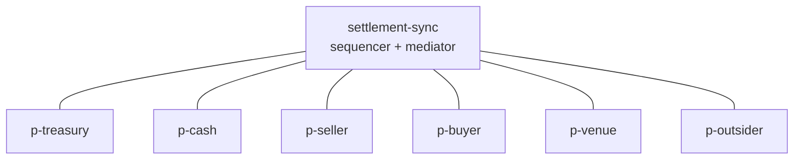

# canton-treasury-dvp

Atomic Delivery-versus-Payment settlement of a tokenized Treasury instrument against a regulated
payment stablecoin, across independently governed Canton applications.

The two assets are issued and administered by two separate registries that share no code and no
package dependency. A third, independently governed settlement application composes them into a
single atomic trade. No participant in the system sees more than the data it needs.

## Why this is a Canton-specific design

The problem this repository models is not "move two tokens". It is: *two independently governed
issuers, who do not trust each other and do not share a codebase, must exchange assets with no
settlement risk, while each party learns only its own side of the trade.*

That combination is what Canton provides and what a single shared global ledger does not:

- **Atomic composition across applications.** The Treasury registry and the stablecoin registry are
  separate Daml packages with no dependency on each other. The settlement package depends on
  neither. They compose at runtime through the Canton Token Standard interfaces, and both legs
  commit in one transaction.
- **Sub-transaction privacy.** Canton projects each transaction to the parties entitled to see each
  node. The Treasury registry helps settle the trade without learning the cash amount; the
  stablecoin registry settles without learning the bond quantity; neither learns the trade price.
- **Multi-party authorization.** The trade contract is jointly signed by venue, seller, and buyer,
  so no single party can move another party's assets.
- **Independent governance.** Each application is upgraded, vetted, and operated separately. A
  participant may vet a package and still see none of the contracts created under it.

## The atomic DvP invariant

> Either the buyer receives the Treasury units **and** the seller receives the stablecoins, or
> neither transfer happens and every input remains exactly as it was.

There is no intermediate state in which one leg has settled and the other has not, and no window in
which a party is exposed to the other side's performance. Both legs execute as consequences of a
single choice, `DvpTrade_Settle`, in one Daml transaction. If either leg fails for any reason, the
entire transaction is rejected and no asset moves.

This invariant is asserted directly: the Daml Script suite drives each leg into failure and proves
that no partial settlement is observable.

## Components

| Component | Package | Responsibility |
|---|---|---|
| Treasury registry | `daml/treasury-registry` | Treasury instrument, holdings, eligibility, allocation |
| Stablecoin registry | `daml/stablecoin-registry` | Stablecoin instrument, holdings, eligibility, mint and burn |
| Settlement | `daml/dvp-settlement` | Trade proposal, jointly signed trade, atomic settlement |
| Unit tests | `daml/tests` | 194 Daml Script tests |
| Integration | `daml/integration`, `daml/integration-control` | Multi-participant scenario and stream control event |

**Compliance** is modelled as per-registry eligibility attestations. Each registry issues its own
attestations for its own instrument, holds no personal data on ledger, and enforces eligibility
**only when an allocation is created**. Settlement itself performs no compliance check, which keeps
the atomic step self-contained and free of external dependencies at the moment of commitment.

The two registries are deliberately symmetric but independent: neither imports the other, and the
same eligibility idea is implemented twice rather than shared through a common package.

## Canton Token Standard

The registries implement Canton Network Token Standard **V1** interfaces (CIP-0056), vendored as
DARs in `lib/` from the Splice `v0.6.14` release bundle:

| Interface package | Version |
|---|---|
| `splice-api-token-metadata-v1` | 1.0.0 |
| `splice-api-token-holding-v1` | 1.0.0 |
| `splice-api-token-allocation-v1` | 1.0.0 |
| `splice-api-token-allocation-instruction-v1` | 1.0.0 |
| `splice-api-token-allocation-request-v1` | 1.0.0 |

Holdings implement `Holding`. Each registry exposes an `AllocationFactory` and produces
`Allocation` contracts that lock the sender's holding. The settlement package implements
`AllocationRequest`, so each registry independently discovers the legs it is being asked to fund
without depending on the settlement package's templates.

## Topology (M5)

M5 runs the whole application on **one local synchronizer**, `settlement-sync`, with six
independent participant nodes. Both Treasury and stablecoin holdings originate on this
synchronizer.



Each party is hosted on exactly one participant, and every command is submitted through the
participant that hosts the acting party.

| Participant | Party | Ledger API port |
|---|---|---|
| `p-treasury` | `treasuryRegistry` | 5011 |
| `p-cash` | `cashRegistry` | 5021 |
| `p-seller` | `seller` | 5031 |
| `p-buyer` | `buyer` | 5041 |
| `p-venue` | `venue` | 5051 |
| `p-outsider` | `outsider` | 5061 |

`p-outsider` is connected to `settlement-sync` and has every project package vetted, but hosts no
party involved in the trade. It exists to prove that connectivity and package availability are not
data visibility.

## DvP workflow

1. `treasuryRegistry` creates the Treasury instrument and issues 100 units to `seller`.
2. `cashRegistry` creates the stablecoin instrument and mints 100,000 to `buyer`.
3. Each registry issues eligibility attestations for its own instrument.
4. `seller` creates a `DvpProposal`.
5. `seller` and `buyer` each accept; approval is progressive and recorded on the proposal.
6. `venue` initiates settlement, creating the jointly signed `DvpTrade`.
7. `seller` allocates the Treasury leg through the Treasury `AllocationFactory`, which checks
   eligibility and locks the holding.
8. `buyer` allocates the payment leg through the stablecoin `AllocationFactory`.
9. `venue` exercises `DvpTrade_Settle` once. Both legs execute in that single transaction.

## Authorization model

- `DvpProposal` is signed by the seller and by each party that has approved. A party can only
  approve for itself, cannot approve twice, and the venue cannot approve on anyone's behalf.
- `DvpTrade` is signed jointly by `venue`, `seller`, and `buyer`. No subset can create it. This
  joint signature is what supplies the authority to execute both allocations later.
- `DvpTrade_Settle` is controlled by the venue, but it can only act within authority the seller and
  buyer already granted by signing the trade.
- Settlement validates the supplied allocations by **exact match**: each leg must be backed by
  exactly one allocation whose full specification, including the settlement reference, equals what
  the trade expects. Allocations created for a different trade are rejected even when the parties,
  amounts, and deadlines are identical, because each trade's settlement reference is derived from
  its originating proposal contract ID.

## Privacy model

Canton projects each transaction node only to the parties entitled to see it. The result, verified
against live participant update streams rather than assumed:

| Participant | Sees | Does not see |
|---|---|---|
| `p-treasury` | Treasury instrument, holdings, its eligibility inputs, Treasury allocation, Treasury settlement leg | Any stablecoin contract, the payment amount, the `DvpTrade` payload or price |
| `p-cash` | Stablecoin instrument, holdings, its eligibility inputs, stablecoin allocation, payment settlement leg | Any Treasury contract, the Treasury quantity, the `DvpTrade` payload or price |
| `p-seller` | Proposal, trade, both allocations, settlement outcome, its original Treasury holding, its resulting stablecoins | The buyer's original stablecoin holding, the outsider's contracts |
| `p-buyer` | Proposal, trade, both allocations, settlement outcome, its original stablecoins, its resulting Treasury units | The seller's original Treasury holding, the outsider's contracts |
| `p-venue` | Proposal approvals, full trade terms, both allocations, both settlement outcomes | Any eligibility attestation, unrelated holdings |
| `p-outsider` | Only its own control contract | Every proposal, trade, allocation, holding, eligibility, and settlement event |

Each registry helps settle a trade whose price it never learns.

## The atomic boundary

The atomic unit is **one Daml transaction on one synchronizer**. `DvpTrade_Settle` validates both
legs and executes both `Allocation_ExecuteTransfer` choices as consequences of that single choice.
Canton commits or rejects the whole transaction.

**Reassignment is outside this boundary.** Moving a contract between synchronizers is a separate
Canton protocol step that happens *before* settlement, never inside the settlement transaction. An
atomic trade cannot span two synchronizers in one transaction; the inputs must first be brought onto
a common synchronizer, and only then can they be settled atomically. M5 does not implement or claim
reassignment: every holding here is created on `settlement-sync` and stays there.

## Technology

| Component | Version |
|---|---|
| Daml SDK | 3.5.5 |
| Canton runtime | 3.5.12 (open source) |
| Daml-LF target | 2.2 |
| JDK | 21 |
| Canton Token Standard | V1 (CIP-0056) |

## Repository structure

```
canton/
  settlement-topology.conf   node definitions for the local synchronizer and six participants
  remote-console.conf        remote console handles used by privacy verification
  participants.json          Daml Script participant mapping
  run-integration.sh         one-command integration run
  scripts/
    bootstrap.canton         synchronizer bootstrap, connections, DAR upload and vetting
    verify-privacy.canton    per-participant update-stream privacy assertions
daml/
  treasury-registry/         Treasury instrument, holdings, eligibility, allocation
  stablecoin-registry/       stablecoin instrument, holdings, eligibility, allocation
  dvp-settlement/            proposal, jointly signed trade, atomic settlement
  tests/                     194 Daml Script tests
  integration/               multi-participant scenario script
  integration-control/       test-only control template for stream verification
lib/                         vendored Canton Token Standard V1 DARs
```

## Prerequisites

- Daml SDK 3.5.5 via `dpm`, with `dpm` on `PATH`
- JDK 21
- The Canton runtime, which `dpm` installs under `~/.dpm/cache/components/canton-open-source`

No database, container runtime, or authentication service is required. All nodes use in-memory
storage.

## Build

```bash
dpm build --all
```

## Daml Script tests

The unit suite runs on the in-memory ledger and needs no Canton node:

```bash
cd daml/tests && dpm test
```

Expected: **194 tests pass**. These cover holdings, mint and burn, eligibility, allocation
lifecycle, exact-leg validation, settlement-reference isolation, and the no-partial-settlement
invariant.

## M5 integration test

The integration test starts the local topology, runs the full DvP across six participants, and
verifies privacy from each participant's update stream:

```bash
dpm build --all
./canton/run-integration.sh
```

This starts Canton, bootstraps `settlement-sync`, connects all six participants, uploads and vets
the packages, records a per-participant offset checkpoint, executes the scenario through the six
Ledger API endpoints, runs the privacy assertions over the post-bootstrap window, and shuts the
nodes down. It takes roughly one minute and is repeatable from a cold start.

Because the venue is not a stakeholder on the locked holdings, and the seller and buyer are not
stakeholders on each other's eligibility attestations or on the registry rules contracts, the
scenario passes those contracts as **explicitly disclosed contracts** at submission time. This is
the Canton-native mechanism for cross-participant visibility; no observer is widened to make the
workflow succeed.

### Expected result

```
CONNECTED p-treasury settlement-sync          (and five more)
VETTED p-treasury <package ids>               (and five more)
CHECKPOINT p-treasury=<offset>                (and five more)
Integration.Scenario:dvpAcrossParticipants SUCCESS
PRIVACY_OK ...                                (72 assertions)
PRIVACY_VERIFIED
INTEGRATION_COMPLETE
```

The scenario asserts that the buyer ends with exactly 100 Treasury units, the seller with exactly
100,000 stablecoins, both allocations and the trade are consumed, no duplicate receiver holding
exists, and both instrument totals are conserved.

The run fails if any participant is unreachable or disconnected, a party is hosted on the wrong
participant, a required package is not vetted, the inspected stream window is empty or
misconfigured, final holdings are wrong, or any participant observes data it should not.

## Status

**Complete through M5.**

- M1: Treasury instrument and standard-compatible holdings
- M2: independently governed stablecoin package with registry-controlled mint and burn
- M3: per-registry eligibility and Token Standard allocations with locked holdings
- M4: atomic DvP settlement with exact-leg validation and proven no-partial-settlement
- M5: six-participant local topology, multi-participant execution, and verified privacy

**Remaining:**

- **M6**: a second synchronizer (`treasury-sync`) and Canton reassignment, moving Treasury holdings
  onto `settlement-sync` before settlement, with tests for unassignment and assignment. Cross-
  synchronizer reassignment is **not** implemented or claimed in M5.
- **M7**: one-command demo packaging of the full story.

## Non-goals

This repository is a protocol and modelling demonstration. It does not include, and does not claim:

- No Solana integration, bridge, or any other chain
- No frontend, backend service, or REST API
- No PostgreSQL, Docker, or authentication infrastructure
- No Canton Network or Global Synchronizer deployment
- No Token Standard V2
- No production deployment or operational hardening

The local topology demonstrates **protocol behavior**: how Canton enforces atomicity, authorization,
and need-to-know visibility across independently governed applications. It does not demonstrate
decentralized organizational governance. Real independent governance means separate legal entities
operating separate nodes; here all six participants run on one machine to make the protocol
behavior observable and testable.

## License

Licensed under the Apache License, Version 2.0. See [LICENSE](LICENSE).
